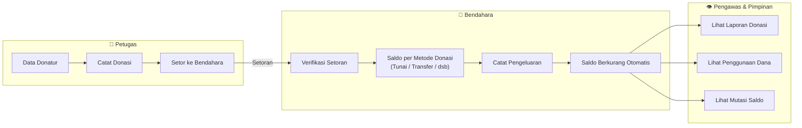

t# 🕌 Aplikasi Baitul Maal — Ponpes Ar-Rosyad

Aplikasi manajemen donasi untuk Divisi Baitul Maal Ponpes Ar-Rosyad. Mencakup pendataan donatur, pencatatan donasi, penyetoran ke bendahara, verifikasi, pengeluaran, dan pelaporan — dengan Role-Based Access Control (RBAC) untuk 5 jenis pengguna.

---

## Tahapan Pengerjaan

| Tahap | Deskripsi | Status |
|-------|-----------|--------|
| **Tahap 1** | Pondasi — Setup Next.js Project + GitHub | ✅ Selesai |
| **Tahap 2** | UI/UX — Semua halaman, komponen & Role-Based Dashboard | ✅ Selesai |
| **Tahap 3** | Deployment ke Vercel (`https://baitul-maal.vercel.app`) | ✅ Selesai (Live) |
| **Tahap 4** | Database & Real Auth (Neon PostgreSQL + Prisma/NextAuth) | 🔄 Skema & Seed Selesai, Integrasi API |
| **Tahap 5** | Cloud Storage (Google Drive / S3) | ⏳ Menunggu |

---

## Progres Saat Ini (Tahap 1 & 2 Selesai)

Aplikasi saat ini berjalan menggunakan data simulasi (Mock Data) yang tersimpan di memori lokal peramban. Fitur dan halaman berikut ini telah dikembangkan dan diselesaikan dari sisi antarmuka dan interaksinya:

- [x] **Setup Next.js 15 project**
- [x] **Design System (globals.css)** — Tema hijau (`#91c641`), dark mode islami, glassmorphism
- [x] **RBAC System (`lib/rbac.js`)** — Akses per menu berdasarkan peran pengguna
- [x] **Auth Context & Data Context** — Pengelolaan data & sesi log in pengguna
- [x] **Halaman Login & Lupa Password**
- [x] **Dashboard** — Ringkasan kas dan kinerja petugas
- [x] **Modul Pendataan** — Daftar Donatur, Form Tambah dengan API Wilayah Indonesia (A-Z), Detail, dan Edit
- [x] **Modul Penerimaan (Petugas)** — Catat Donasi Baru, Riwayat Catatan, dan Setor ke Bendahara
- [x] **Modul Keuangan (Bendahara)** — Verifikasi Setoran (Terima/Tolak), Catat Pengeluaran dengan validasi limit saldo, dan Buku Kas (mutasi per metode)
- [x] **Modul Laporan** — Laporan Donasi Masuk, Penggunaan Dana, dan Mutasi Saldo
- [x] **Modul Pengaturan** — Master Kategori Donasi, Metode Donasi, Pos Pengeluaran, Manajemen Pengguna & Role, serta Logo Lembaga
- [x] **Penghapusan Bottom Nav** — Fitur Bottom Navigation untuk mobile telah dihilangkan atas permintaan untuk memberikan kelegaan tampilan (*space*) ekstra pada halaman (navigasi beralih menggunakan *Sidebar/Hamburger Menu*)

---

## Information Architecture (IA)

### Peta Keseluruhan Sistem

```mermaid
graph TD
    A["🕌 Baitul Maal<br/>Ponpes Ar-Rosyad"] --> B["🔐 Autentikasi"]
    A --> C["📊 Dashboard"]
    A --> D["📋 Pendataan"]
    A --> E["💰 Penerimaan"]
    A --> F["🏦 Keuangan"]
    A --> G["📈 Laporan"]
    A --> H["⚙️ Pengaturan"]

    B --> B1["Login"]
    B --> B2["Lupa Password"]

    C --> C1["Ringkasan Kas"]
    C --> C2["Ringkasan Kinerja Petugas"]

    D --> D1["Daftar Donatur"]
    D --> D2["Tambah/Edit Donatur"]

    E --> E1["Catat Donasi Baru"]
    E --> E2["Riwayat Catatan Petugas"]
    E --> E3["Setor ke Bendahara"]

    F --> F1["Verifikasi Setoran"]
    F --> F2["Catat Pengeluaran"]
    F --> F3["Buku Kas / Saldo Dompet"]

    G --> G1["Laporan Donasi Masuk"]
    G --> G2["Laporan Penggunaan Dana"]
    G --> G3["Mutasi Saldo"]

    H --> H1["Master Kategori Donasi"]
    H --> H2["Master Metode Donasi"]
    H --> H3["Master Pos Pengeluaran"]
    H --> H4["Manajemen Pengguna & Role"]
```

---

### Alur Bisnis Utama (Business Flow)

---

## Akses per Role (RBAC Matrix)

| Menu | SuperAdmin | Admin | Bendahara | Petugas | Pengawas |
|------|:---:|:---:|:---:|:---:|:---:|
| Dashboard | ✅ Full | ✅ Full | ✅ Kas Only | ✅ Own Stats | ✅ Full (Read) |
| Pendataan Donatur | ✅ CRUD | ✅ CRUD | ❌ | ✅ CRUD | ✅ Read |
| Catat Donasi | ✅ | ✅ | ❌ | ✅ Own | ✅ Read |
| Riwayat Catatan | ✅ All | ✅ All | ❌ | ✅ Own | ✅ All (Read) |
| Setor ke Bendahara | ✅ | ✅ | ❌ | ✅ Own | ✅ Read |
| Verifikasi Setoran | ✅ | ✅ | ✅ | ❌ | ✅ Read |
| Catat Pengeluaran | ✅ | ✅ | ✅ | ❌ | ✅ Read |
| Buku Kas / Saldo | ✅ | ✅ | ✅ | ❌ | ✅ Read |
| Laporan Donasi | ✅ | ✅ | ✅ | ❌ | ✅ |
| Laporan Penggunaan | ✅ | ✅ | ✅ | ❌ | ✅ |
| Mutasi Saldo | ✅ | ✅ | ✅ | ❌ | ✅ |
| Master Kategori Donasi | ✅ CRUD | ✅ CRUD | ❌ | ❌ | ❌ |
| Master Metode Donasi | ✅ CRUD | ✅ CRUD | ❌ | ❌ | ❌ |
| Master Pos Pengeluaran | ✅ CRUD | ✅ CRUD | ❌ | ❌ | ❌ |
| Manajemen User & Role | ✅ CRUD | ❌ | ❌ | ❌ | ❌ |

---

## Tech Stack (Current)

| Layer | Teknologi |
|-------|-----------|
| Framework | **Next.js 15** (App Router) |
| Styling | **Vanilla CSS** (Mobile-First, Custom Design System di `globals.css`) |
| Icons | **Lucide React** (Versi Outline) |
| Font | **Google Fonts — Inter** |
| State | React Context + useReducer (menggunakan Mock Data via `lib/mock.js`) |
| Charts | **Chart.js** via react-chartjs-2 |

## Tech Stack (Tahap 3 - 5)

| Layer | Teknologi |
|-------|-----------|
| Deployment | **Vercel** |
| Authentication | **NextAuth.js (Auth.js)** |
| Database | **Neon PostgreSQL** |
| ORM | **Prisma** atau **Drizzle** |
| Storage | **Google Drive API** (Untuk gambar, berkas donatur/logo) |

---

## Demo Akun (Untuk Pengujian Saat Ini)

Masuk ke aplikasi dengan surel berikut sesuai peran (Kata sandi untuk semuanya: `admin123`):

| Role | Email |
|------|-------|
| Super Admin | `superadmin@arrosyad.id` |
| Admin | `admin@arrosyad.id` |
| Bendahara | `bendahara@arrosyad.id` |
| Petugas | `petugas1@arrosyad.id` |
| Pengawas | `pengawas@arrosyad.id` |

---

## Langkah Selanjutnya

Ketika ingin melanjutkan proyek ke tahap berikutnya (Tahap 3-5), silakan gunakan berkas ini sebagai referensi arsitektur dan status progres saat ini kepada *developer* Anda. Integrasi *Database* dan Autentikasi yang sesungguhnya (tidak lagi menggunakan Mock Data) akan menjadi fokus utama.
